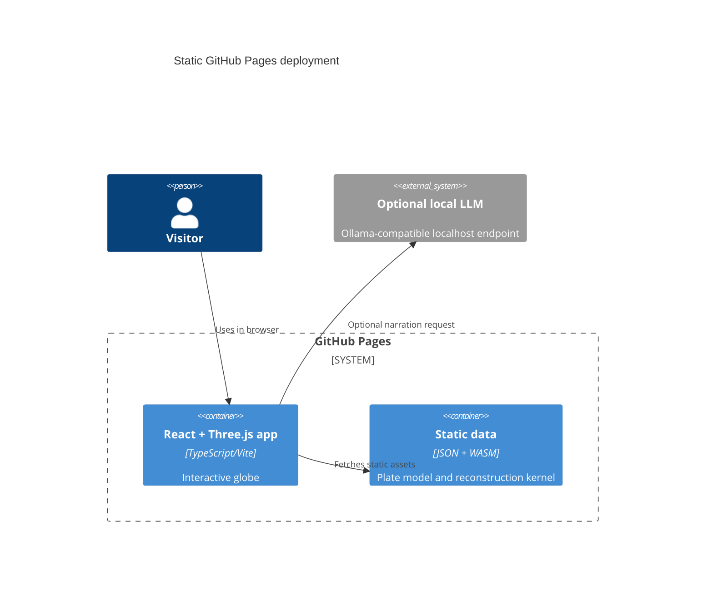

# Plate-Tectonics Deep-Time Visualizer

Live site: https://baditaflorin.github.io/plate-tectonics-deep-time-visualizer/

Repository: https://github.com/baditaflorin/plate-tectonics-deep-time-visualizer

Support: https://www.paypal.com/paypalme/florinbadita

A static WebGPU-first globe that animates 600 million years of approximate plate
motion, mountain-building pulses, and narrated geologic events. It is built for
students, educators, and curious map people who want the shape of deep time to
feel visible.

## Quickstart

```bash
npm install
make install-hooks
make dev
make test
make smoke
```

## Architecture



## What Ships In V1

- Mode A GitHub Pages deployment from `main` `/docs`.
- Lazy Three.js globe with WebGPU renderer when available and WebGL fallback.
- Static `public/data/v1` tectonic model with metadata.
- WASM reconstruction kernel plus TypeScript fallback.
- Browser narration with optional local LLM endpoint.
- Playwright smoke test for load, links, WASM/data initialization, and timeline interaction.

## Documentation

Architecture: docs/architecture.md

Data contract: docs/data.md

Deploy guide: docs/deploy.md

Privacy: docs/privacy.md

ADRs: docs/adr/
