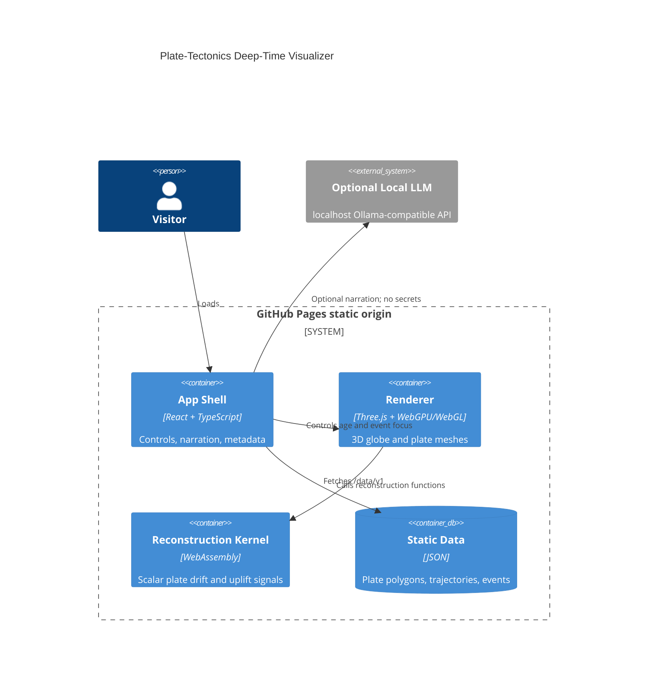

# Architecture

```mermaid
C4Container
  title Plate-Tectonics Deep-Time Visualizer
  Person(visitor, "Visitor")
  System_Boundary(ghp, "GitHub Pages static origin") {
    Container(shell, "App Shell", "React + TypeScript", "Controls, narration, metadata")
    Container(globe, "Renderer", "Three.js + WebGPU/WebGL", "3D globe and plate meshes")
    Container(wasm, "Reconstruction Kernel", "WebAssembly", "Scalar plate drift and uplift signals")
    ContainerDb(data, "Static Data", "JSON", "Plate polygons, trajectories, events")
  }
  System_Ext(ollama, "Optional Local LLM", "localhost Ollama-compatible API")
  Rel(visitor, shell, "Loads")
  Rel(shell, globe, "Controls age and event focus")
  Rel(globe, wasm, "Calls reconstruction functions")
  Rel(shell, data, "Fetches /data/v1")
  Rel(shell, ollama, "Optional narration; no secrets")
```

The public runtime boundary is GitHub Pages only. There is no server, runtime
database, authentication, or secret-bearing API in v1.
